# Bank Electrical Systems Design Project

An institutional-grade electrical engineering design and technical specification for a multi-story commercial banking branch. Engineered to comply with international electrotechnical standards (IEC, DIN, NFPA, EN) and local Syndicate regulations, the design ensures continuous, resilient operation of high-security banking infrastructure.

## 1. Overview / Abstract
This project presents the complete electrical systems design for a multi-story commercial bank building, dividing the engineering methodology into strong-current power distribution and weak-current systems. The design provides a comprehensive blueprint for lighting layout, general-purpose and dedicated power distribution, three-phase heavy machinery sizing, secondary substation infrastructure (dry-type transformer, busbar assemblies, and ATS-coupled backup generation), and coordinated protection networks. Additionally, it integrates essential auxiliary systems, including an addressable fire alarm system, high-speed structured data cabling, and comprehensive CCTV monitoring to meet the rigorous security demands of banking facilities.

## 2. Problem Statement
Commercial banking facilities represent highly sensitive engineering environments that require extreme operational resilience and strict safety protections:
1. **Uninterrupted Power Availability:** Banking databases and transaction terminals must have 100% electrical availability. Any power disruption can cause severe database corruption, monetary loss, and compromised security.
2. **Sensitive Load Isolation:** Harmonics and line noise from heavy non-linear loads (such as variable refrigerant volume (VRV) HVAC systems, water pumps, and elevators) must be isolated from sensitive IT infrastructure, servers, and automated teller machines (ATMs).
3. **Severe Safety Hazards:** Due to the metallic and dense physical nature of bank vaults and structural concrete, grounding systems must be engineered with low resistance ($R \le 5\ \Omega$) to prevent high-voltage build-up during phase-to-ground faults or structural lightning strikes.
4. **Active Security and Life Safety:** Banking spaces require fully integrated, addressable monitoring networks to rapidly detect, localize, and suppress early-stage fire hazards and physical breaches.

## 3. Methodology & Software Used
The electrical design was modeled and sized using a rigorous engineering pipeline:
* **CAD & Drafting:** **AutoCAD 2024** was utilized to create floor plan layouts, conduit routing plans, detailed wiring schematics, and the comprehensive Single-Line Diagram (SLD).
* **Lighting Sizing:** The Lumen Method was applied to calculate the optimal fixture quantity and spatial density for each room based on targeted lux levels (from 100 to 800 Lux), maintenance factors ($MF$), and utilization factors ($UF$).
* **Cable & Protection Sizing:** Performed in accordance with **IEC 60364** and German cable standard classifications (using XLPE-insulated halogen-free $N2XH$ and $H2XH$ cables). Derating factors for temperature, grouping, and wall-mounting were applied.
* **Symmetrical Voltage Drop Analysis:** Voltage drop calculations were executed using the formula:
  $$\Delta U = \frac{2 \cdot \rho \cdot L}{A} \cdot I \cdot \cos\phi$$
  where $\rho_{\text{Cu}} = 0.0178\ \Omega\cdot\text{mm}^2/\text{m}$ for copper conductors, restricting voltage drop to strictly $< 3\%$ across all branch circuits.
* **Soil Resistivity & Earthing Analysis:** Based on the **Wenner Four-Electrode Method** to assess earth resistance ($R_{eq}$), treating the grounding pit with sand, salt, and charcoal to safely suppress soil resistivity down to $\rho = 25\ \Omega\cdot\text{m}$.
* **Lightning Protection Sizing:** Sized utilizing the **Angle of Protection/Shielding Angle Method** in compliance with **IEC 62305**.

## 4. System Architecture & Technical Specifications

### A. Power Distribution System (Strong Current)
The facility is powered by a coordinated secondary substation feeding a Main Distribution Board (MDB) and three Sub-Distribution Boards (SDB-1, SDB-2, SDB-3):

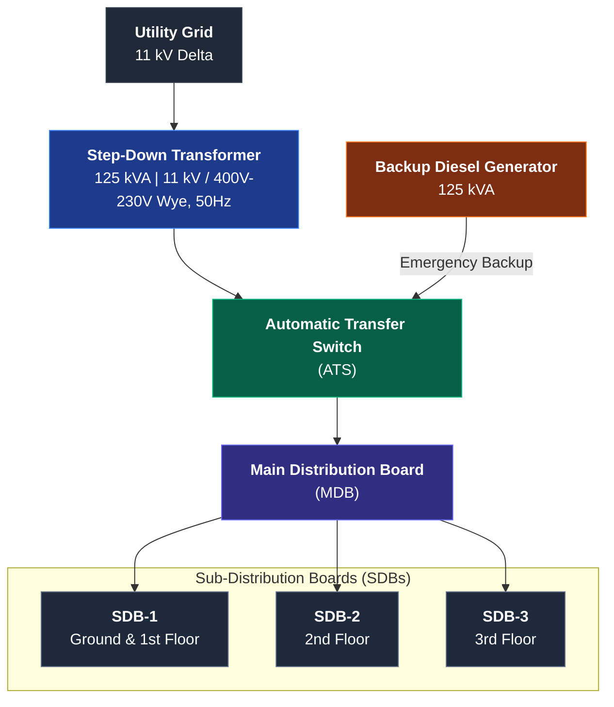
```mermaid
flowchart TD
    %% Node Definitions
    Grid["<b>Utility Grid</b><br/>11 kV Delta"]
    XFMR["<b>Step-Down Transformer</b><br/>125 kVA | 11 kV / 400V-230V Wye, 50Hz"]
    Gen["<b>Backup Diesel Generator</b><br/>125 kVA"]
    ATS["<b>Automatic Transfer Switch</b><br/>(ATS)"]
    MDB["<b>Main Distribution Board</b><br/>(MDB)"]

    %% Sub-Distribution Subgraph
    subgraph SDB_Group ["Sub-Distribution Boards (SDBs)"]
        direction LR
        SDB1["<b>SDB-1</b><br/>Ground & 1st Floor"]
        SDB2["<b>SDB-2</b><br/>2nd Floor"]
        SDB3["<b>SDB-3</b><br/>3rd Floor"]
    end

    %% Electrical Connections
    Grid --> XFMR
    XFMR --> ATS
    Gen -->|Emergency Backup| ATS
    ATS --> MDB
    MDB --> SDB1
    MDB --> SDB2
    MDB --> SDB3

    %% Styling / Color Theme
    style Grid fill:#1f2937,stroke:#374151,color:#fff
    style XFMR fill:#1e3a8a,stroke:#3b82f6,color:#fff
    style Gen fill:#7c2d12,stroke:#f97316,color:#fff
    style ATS fill:#065f46,stroke:#10b981,color:#fff
    style MDB fill:#312e81,stroke:#6366f1,color:#fff
    style SDB1 fill:#1e293b,stroke:#64748b,color:#fff
    style SDB2 fill:#1e293b,stroke:#64748b,color:#fff
    style SDB3 fill:#1e293b,stroke:#64748b,color:#fff
```

#### 1. Incoming Utility Substation
* **Distribution Transformer:** Sized at **125 kVA**, Dry-Type, Class F insulation.
  * *Voltage Configuration:* Primary Delta $11\text{ kV}$ $\rightarrow$ Secondary Wye $0.4\text{ kV}$ ($\pm 5\%$ tap-changer).
  * *Windings:* 100% Copper, frequency $50\text{ Hz}$.
  * *Physical Specifications:* $1.2 \times 0.8 \times 1.2\text{ m}$, weight approx. $1200\text{ kg}$.
* **Busbar System:** Sized for a nominal rating of **205 A**. Single copper busbar, painted, housed in a closed enclosure, featuring a cross-sectional area of $39.5\text{ mm}^2$ (dimensions $20 \times 2\text{ mm}$).

#### 2. Automatic Transfer Switch (ATS) & Backup Generator
In the event of a utility grid failure, a **125 kVA Cummins C100 D5** diesel generator starts automatically within seconds to pick up the critical loads via a logically and mechanically interlocked ATS.
* **Backup Generator Parameters:**
  * *Prime Rating:* $125\text{ kVA} / 100\text{ kW}$ at $0.8\text{ PF}$.
  * *Standby Rating:* $137.5\text{ kVA} / 110\text{ kW}$ at $0.8\text{ PF}$.
  * *Nominal Output Current:* $180\text{ A}$ ($400\text{V}$, 3-phase + N + PE).
  * *Engine Unit:* Cummins 4BTA3.9G8 water-cooled, 4-cylinder diesel engine operating at $1500\text{ rpm}$.
  * *Control Module:* Deepsea DSE 7320 automatic controller featuring overcurrent, low-oil-pressure, and high-temperature protection.
  * *Fuel System:* $220\text{ L}$ fuel tank, consumption of $\approx 19\text{ L/h}$ at 75% load.
  * *Alternator Unit:* Stamford Brushless, IP23, insulation Class H.
* **ATS Circuit Details:** Controlled by NC/NO limit switches, relay coils, time-on/time-off coils, and contactors $K_1$ (utility mains) and $K_2$ (generator) to prevent parallel grid-generator synchronization, protected upstream by dual 200A MCCBs.

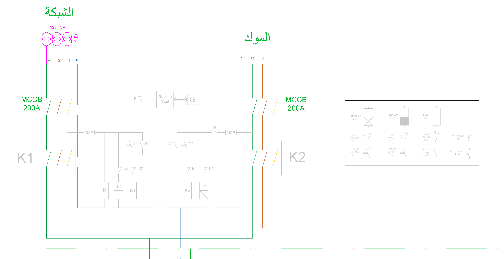
> **[📄 Click here to download or view the high-resolution PDF diagram.](Diagrams/ATS_diagram.pdf)**

#### 3. Distribution Boards & Cable Sizing
The sub-distribution panels are sized according to cumulative active and reactive loads:
* **SDB-1 (Ground & First Floor):** Sized for a total capacity of **$10,840.8\text{ W}$** at $0.842\text{ PF}$.
  * *Feeder Cable:* Halogen-free, fire-retardant XLPE $(3 \times 6 + 4) + 4\text{ mm}^2$ copper cable.
  * *Protection:* 3-pole 32A MCCB ($I_{cut} = 3\text{ kA}$, thermal trip $I_{r1}=36.16\text{ A}$, magnetic trip $I_{m1}=320\text{ A}$).
* **SDB-2 (Second Floor):** Sized for a total capacity of **$4,902\text{ W}$** at $0.85\text{ PF}$.
  * *Feeder Cable:* XLPE $(3 \times 2.5 + 1.5) + 1.5\text{ mm}^2$ copper cable.
  * *Protection:* 3-pole 16A MCCB ($I_{cut} = 3\text{ kA}$, thermal trip $I_{r1}=18.08\text{ A}$, magnetic trip $I_{m1}=160\text{ A}$).
* **SDB-3 (Third Floor):** Sized for a total capacity of **$5,096\text{ W}$** at $0.845\text{ PF}$.
  * *Feeder Cable:* XLPE $(3 \times 2.5 + 1.5) + 1.5\text{ mm}^2$ copper cable.
  * *Protection:* 3-pole 16A MCCB ($I_{cut} = 3\text{ kA}$, thermal trip $I_{r1}=18.08\text{ A}$, magnetic trip $I_{m1}=160\text{ A}$).
* **MDB (Main Distribution Board incoming):** Total power sum of SDBs + Machinery equals **$90,838.8\text{ W}$** ($107\text{ kVA}$ apparent power) at $0.85\text{ PF}$.
  * *Incoming Feeder Cable:* High-capacity XLPE $(3 \times 95 + 50) + 50\text{ mm}^2$.
  * *Main Incoming Protection:* 3-pole 200A MCCB ($I_{cut}=10\text{ kA}$, thermal trip $I_{r}=226\text{ A}$, magnetic trip $I_{m}=2000\text{ A}$).

#### 4. Heavy Three-Phase Machinery Sizing
Inductive machinery lines are fed directly from the MDB:
* **Variable Refrigerant Volume (VRV) HVAC System (Daikin RXYQ40T):**
  * *Nominal Load:* $60\text{ kW}$ cooling capacity ($17\text{ HP}$), 3-phase $380\text{V}$, nominal current $96\text{ A}$.
  * *Correction/Derating Application:* To protect the cables from thermal degradation, derating parameters were calculated. The main factors utilized include thermal wall conduit installation ($U_4 = 0.74$), temperature corrections for $25^\circ\text{C}$ bank ambient air ($U_3 = 1.04$), and phase unbalance ($U_1 = 0.84$), giving a combined correction factor of $U = 0.873$.
  * *Corrected Design Current ($I_D$):* $110\text{ A}$.
  * *Cable Sizing:* Selected a heavy-duty copper XLPE $(3 \times 50 + 25) + 25\text{ mm}^2$ cable ($I_z = 168\text{ A}$) in a $32\text{ mm}$ PVC conduit.
  * *Breaker:* 3-pole 125A MCCB ($I_{cut}=10\text{ kA}$).
* **Traction Elevator (6 Persons / 450 kg Capacity):** $5.5\text{ kW}$ motor, 3-phase $380\text{V}$, nominal current $10.4\text{ A}$, $0.8\text{ PF}$. Fed by XLPE $(3 \times 4 + 2.5) + 2.5\text{ mm}^2$ cable in $20\text{ mm}$ PVC conduit, protected by a 3-pole 20A MCCB.
* **Water Service Pump (Grundfos CM3-4 Centrifugal Multistage):** $1.5\text{ kW}$ motor, 3-phase $380\text{V}$, nominal current $2.69\text{ A}$, $0.85\text{ PF}$. Fed by XLPE $(3 \times 2.5 + 1.5) + 1.5\text{ mm}^2$ copper cable in a $16\text{ mm}$ PVC conduit, protected by a 3-pole 16A MCCB.
* **Emergency Fire Pump (Wilo-Stratos 50/1-12 EM Multistage):** $3\text{ kW}$ motor, 3-phase $380\text{V}$, nominal current $5.37\text{ A}$, $0.85\text{ PF}$. Fed by XLPE $(3 \times 2.5 + 1.5) + 1.5\text{ mm}^2$ copper cable in a $16\text{ mm}$ PVC conduit, protected by a 3-pole 16A MCCB.

#### 5. Grounding (Earthing) & Lightning Protection
* **Earthing Infrastructure:**
  * *Execution Method:* Soil resistivity measurements were conducted via the Wenner Method. Soil treatment within the inspection pit ($40 \times 40 \times 50\text{ cm}$) using layers of salt, charcoal, and sand suppressed soil resistivity to $\rho = 25\ \Omega\cdot\text{m}$.
  * *Earth Rod Array:* 5 copper-clad steel grounding rods ($1.5\text{ m}$ length, $18\text{ mm}$ diameter) were driven in a linear array. Ground rods are spaced at $3\text{ m}$ ($2 \times L$) to prevent mutual resistance overlaps.
  * *Calculated Equivalent Resistance ($R_{eq}$):* With an electrode multiplying factor ($MF$) of $0.47$ for 5 rods, $R_{eq}$ was calculated to be:
    $$R_{eq} = \frac{R_1}{N \cdot MF} = \frac{12}{5 \cdot 0.47} = 5.1\ \Omega$$
    This safely meets the engineering target limit of $R \le 5\ \Omega$ with highly reliable electrical continuity.
  * *Main Earth Conductor:* Copper wire N2XH $50\text{ mm}^2$.

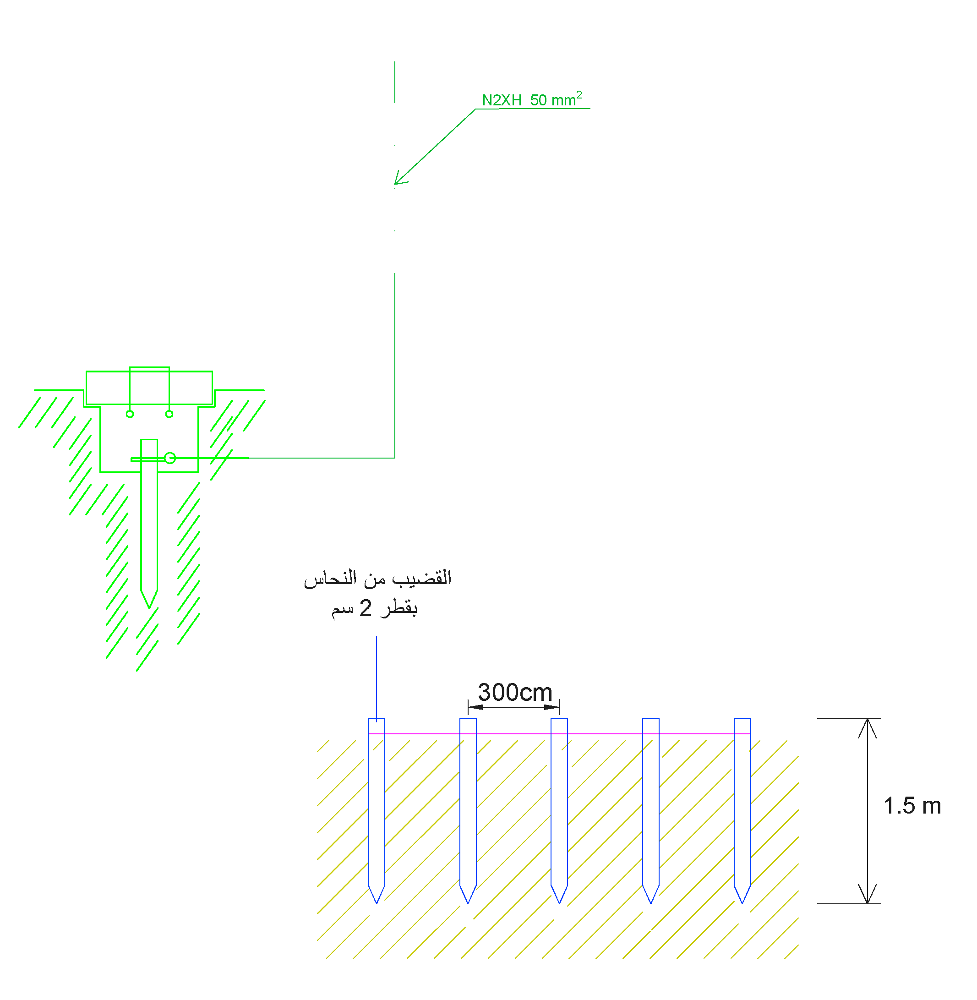
> **[📄 Click here to download or view the high-resolution PDF diagram.](Diagrams/Earthing_system.pdf)**

* **Lightning Protection:**
  * *Building Envelope:* $24\text{ m}$ length $\times$ $20\text{ m}$ width $\times$ $12\text{ m}$ roof height.
  * *Air Termination Rod:* Sized with a single structural copper lightning rod installed on the roof at a height of $h = 25\text{ m}$ above ground.
  * *Calculated Protection Radius ($a_x$ at building level):* Utilizing the Angle of Protection method, the protection radius at the roof level is calculated to be:
    $$a_x = a_0 \cdot \frac{h - h_x}{h} = (1.5 \cdot 25) \cdot \frac{25 - 12}{25} = 19.5\text{ m}$$
    A single lightning rod is sufficient to fully shield the entire bank building envelope.

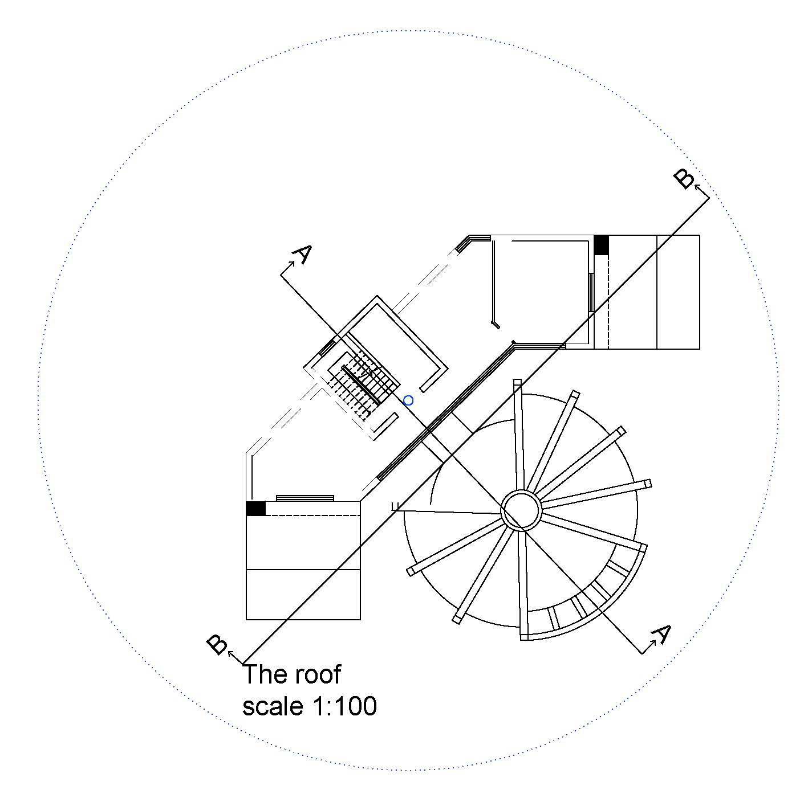
> **[📄 Click here to download or view the high-resolution PDF diagram.](Diagrams/Lightning_protection.pdf)**

### B. Auxiliary Networks (Weak Current)

#### 1. High-Speed Structured Data Network (DATA)
To guarantee secure, high-bandwidth transactions and high-speed communication, a star-topology structured network was designed:
* **Outlets:** Double RJ45 Cat6A copper outlets (dual ports per office desk: one dedicated for IP Phone and one for Desktop PC) supporting transmission rates up to $10\text{ Gbps}$.
* **Distribution & Routing:** Cables are routed through $25\text{ mm}$ PVC conduits under the floorboards.
* **Patch Panel:** 12-port Cat6A UTP $1\text{U}$ Rack-mount Patch Panel with IDC terminations.
* **Core Switch:** Huawei Managed Switch featuring 12x1G ports, supporting Power-over-Ethernet (PoE) with a power budget of $30\text{W}$ per port, and configured for secure Virtual Local Area Network (VLAN) segregation, Quality of Service (QoS) bandwidth management, and Link Aggregation Control Protocol (LACP).
* **Network Cabling:** AWG 23 solid copper Cat6A cables with fire-retardant LSZH (Low Smoke Zero Halogen) jackets to minimize smoke toxicity in the event of an emergency.

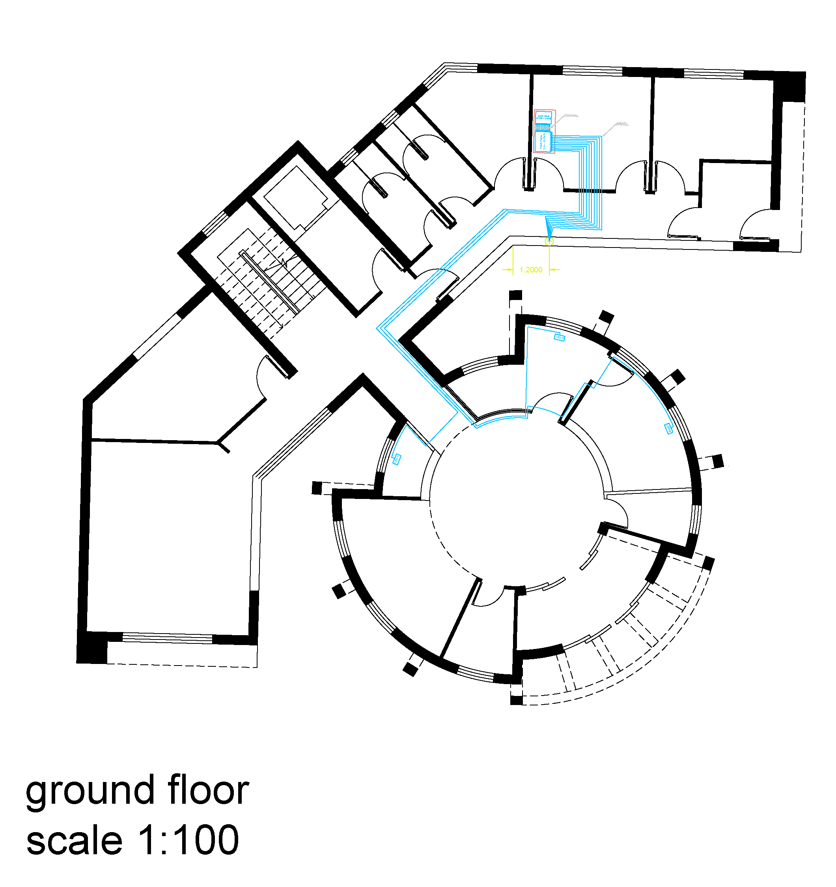
> **[📄 Click here to download or view the high-resolution PDF diagram.](Diagrams/Data_ports_on_the_ground_floor.pdf)**

#### 2. Fire Detection & Alarm System (FDAS)
An addressable fire safety network provides early warning detection across the facility:
* **Control Panel:** Autronic FA-108E Addressable 2-Loop main control panel, supporting up to 126 intelligent field devices per loop, equipped with an LCD interface, front programming keys, emergency outputs (Alarm & Fault), and a $24\text{VDC}$ battery backup system.
* **Field Detectors & Actuators:**
  * *Multi-Sensor Detectors:* Apollo XP95 combination smoke (photoelectric chamber) and heat sensor ($58^\circ\text{C}$ fixed ceiling threshold or dynamic $+8^\circ\text{C/min}$ rate-of-rise).
  * *Manual Call Points:* Addressable Hochiki YBO-R/3 manual alarm call points installed near exits.
  * *Visual-Audible Alarms:* Apollo XP95 addressable sounder-beacons producing a loud $90\text{ dB}$ alarm at $1\text{ m}$ alongside a high-intensity flashing LED beacon.
* **Cabling & Conduits:** Sized using specialized fire-resistant FRLS (Flame Retardant Low Smoke) $2 \times 1.5\text{ mm}^2$ copper cables rated in compliance with **IEC 60331** fire-integrity tests, routed inside $16\text{ mm}$ high-impact PVC conduits.

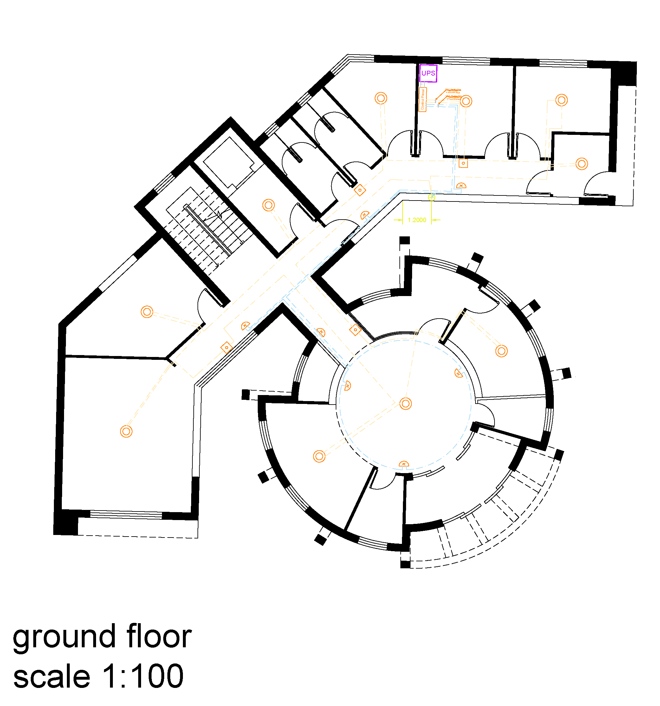
> **[📄 Click here to download or view the high-resolution PDF diagram.](Diagrams/Fire_extinguishing_system_on_the_ground_floor.pdf)**

#### 3. IP CCTV Surveillance Network
For critical high-security banking spaces (vault rooms, tellers, entrances, corridors), an integrated IP-based closed-circuit network was implemented:
* **High-Definition Cameras:** Hikvision DS-2CD2143G0-I 4MP high-resolution network IP cameras, equipped with built-in PoE (802.3af), wide-angle $2.8\text{ mm}$ fixed lenses, and infrared night vision up to $30\text{ m}$.
  * *Deployment:* Anti-vandal **Dome** cameras are used inside offices and corridors, and weather-resistant **Bullet** cameras are used for external perimeter defense.
* **PoE Switching:** Sourced via a TP-Link TL-SF1008P managed PoE switch (incorporating 16x100 Mbps PoE ports, a $60\text{W}$ power budget, and basic VLAN capabilities for network isolation).
* **Network Video Recorder (NVR):** Dahua NVR4108HS-8P-4KS2 16-channel 4K network video recorder, designed for continuous $24/7$ recording, housing an enterprise-grade Western Digital Purple 2TB HDD (7200 RPM, 256MB cache). Outputs are linked to a 22" LED Full HD monitor located in the primary security monitoring room.

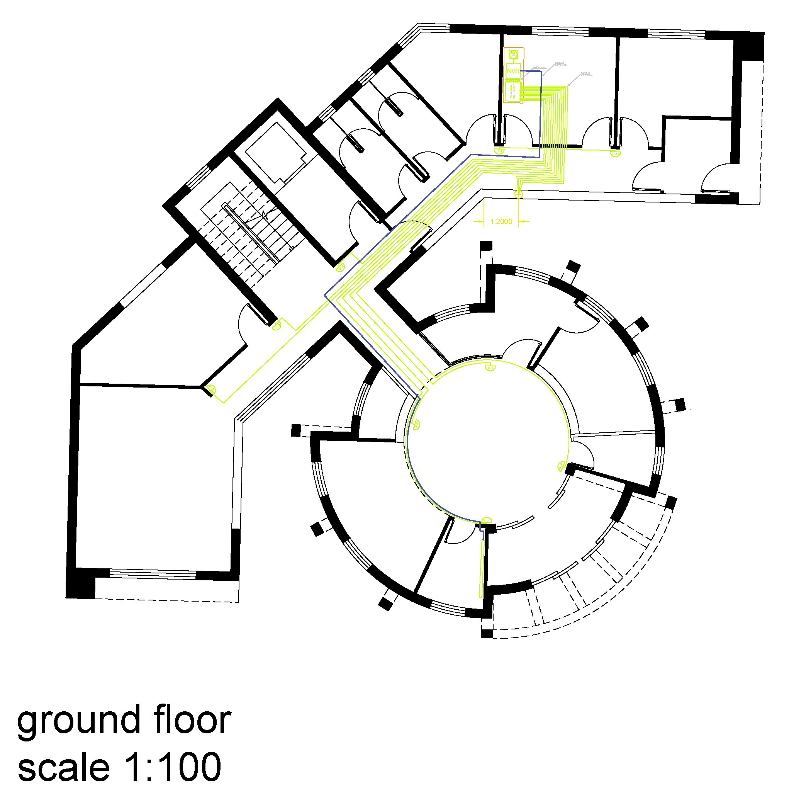
> **[📄 Click here to download or view the high-resolution PDF diagram.](Diagrams/Ground-floor_camera_system.pdf)**

## 5. Results & Analysis

### 1. Lighting Sizing Results
The applying of the Lumen Method resulted in highly efficient fixture densities designed to achieve precise operational illumination:

| Location | Area ($m^2$) | Target (Lux) | MF | UF | Fixture Sized | Lamp Power | Fixture Qty | Total Power |
| :--- | :---: | :---: | :---: | :---: | :--- | :---: | :---: | :---: |
| **Manager Room** | 26 | 750 | 0.9 | 0.8 | LED Panel 60x60 | 40 W | 7 | 280 W |
| **Auditing Room** | 26 | 800 | 0.9 | 0.8 | LED Panel 60x60 | 36 W | 9 | 324 W |
| **Meeting Room** | 27 | 750 | 0.85 | 0.8 | LED Panel 60x60 | 36 W | 9 | 324 W |
| **Cash Counters** | 10 | 500 | 0.9 | 0.8 | LED Panel 30x60 | 24 W | 3 | 72 W |
| **Vault Room** | 33 | 300 | 0.95 | 0.8 | LED Waterproof 2*18 | 36 W | 4 | 144 W |
| **ATM Room** | 4 | 400 | 0.9 | 0.8 | LED Downlight | 9 W | 3 | 27 W |

### 2. Voltage Drop and Circuit Breaker Coordination
Voltage drop calculations demonstrate strict compliance with the $\Delta U\% < 3\%$ design criteria for branch circuits, even at the furthest fixtures and outlets:
* **Lighting p1 (SDB-1):** $\Delta U\% = 1.91\%$ under $1084\text{ W}$ load (MCB 10A, copper $1.5\text{ mm}^2$).
* **Lighting p4 (SDB-1):** $\Delta U\% = 2.64\%$ under $1500\text{ W}$ maximum lighting load (MCB 10A, copper $1.5\text{ mm}^2$).
* **General Outlets p1 (SDB-1):** $\Delta U\% = 2.11\%$ under $2244\text{ W}$ load (MCB 16A, copper $2.5\text{ mm}^2$).
* **Dedicated Outlets (SDB-1):** Max voltage drop of $1.98\%$ for the Data Room UPS line p6 under $3000\text{ W}$ continuous load (MCB 20A, copper $4\text{ mm}^2$).
* **Heavy HVAC System:** $\Delta U\% = 0.336\%$ under full $60\text{ kW}$ load (MCCB 125A, copper $50\text{ mm}^2$).

<table>
  <tr>
    <!-- الصورة الأولى -->
    <td align="center" width="50%">
      <b>Ground Floor Lighting</b>  
      <a href="Diagrams/Ground_Floor_Lighting.pdf" target="_blank">
        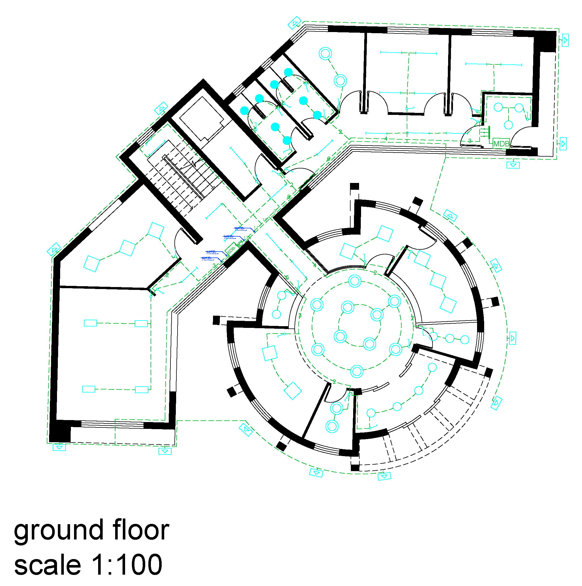
      </a>  
      <a href="Diagrams/Ground_Floor_Lighting.pdf" target="_blank">📄 <b>View High-Res PDF</b></a>
    </td>
    <!-- الصورة الثانية -->
    <td align="center" width="50%">
      <b>General Power for the ground floor</b>  
      <a href="Diagrams/General-purpose_outlets_of_the_ground_floor.pdf" target="_blank">
        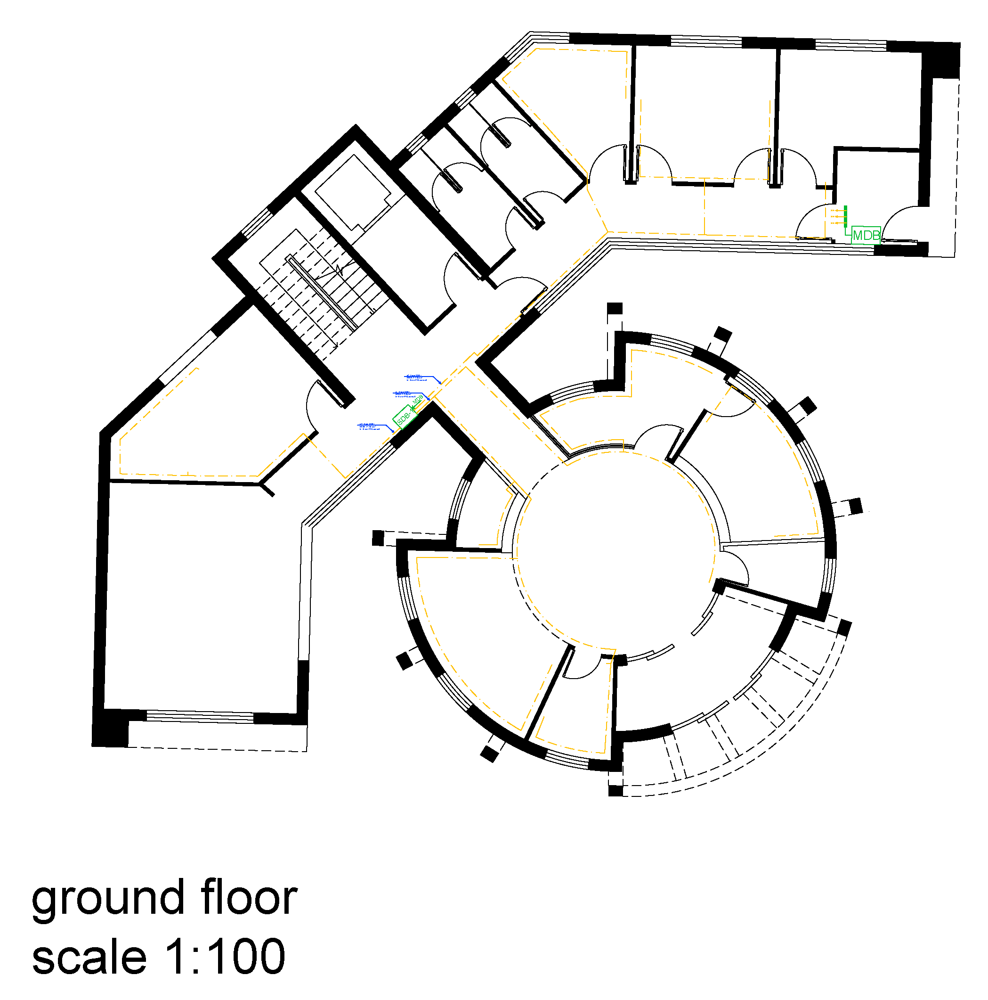
      </a>  
      <a href="Diagrams/General-purpose_outlets_of_the_ground_floor.pdf" target="_blank">📄 <b>View High-Res PDF</b></a>
    </td>
  </tr>
  <tr>
    <!-- الصورة الثالثة -->
    <td align="center" width="50%">
      <b>⚙️ Dedicated Power of the ground floor</b>  
      <a href="Diagrams/Dedicated_outlets_for_the_ground_floor.pdf" target="_blank">
        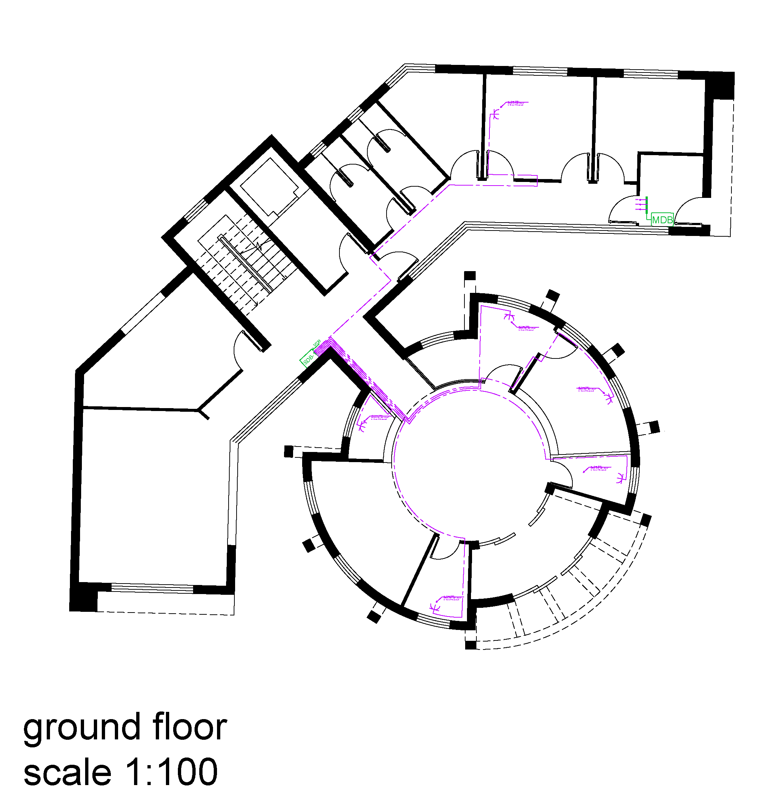
      </a>  
      <a href="Diagrams/Dedicated_outlets_for_the_ground_floor.pdf" target="_blank">📄 <b>View High-Res PDF</b></a>
    </td>
    <!-- الصورة الرابعة -->
    <td align="center" width="50%">
      <b>Ground Floor Machinery</b>  
      <a href="Diagrams/Ground_Floor_Machinery.pdf" target="_blank">
        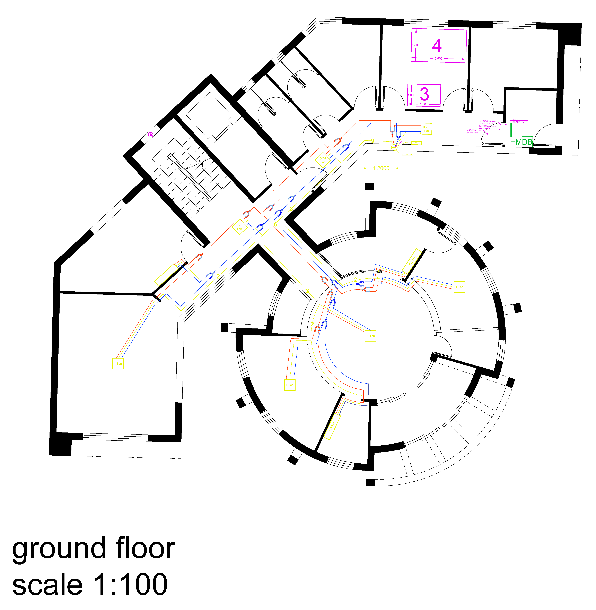
      </a>  
      <a href="Diagrams/Ground_Floor_Machinery.pdf" target="_blank">📄 <b>View High-Res PDF</b></a>
    </td>
  </tr>
</table>

### 3. Integrated Single-Line Diagram (SLD)
The complete Single-Line Diagram links the incoming utility substation transformer, backup generator ATS, power busbars, and distribution boards into a highly integrated and reliable safety scheme.

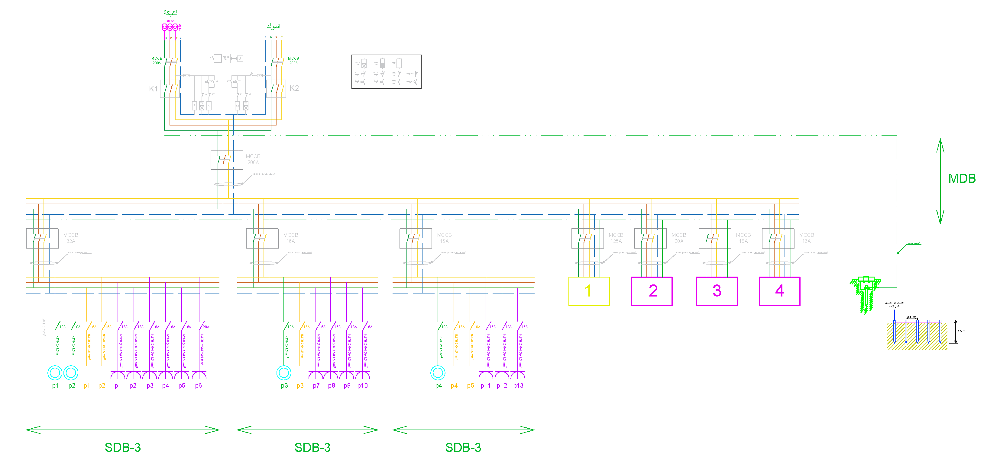
> **[📄 Click here to download or view the high-resolution PDF diagram.](Diagrams/MDB_&_SDB_Wiring_Diagram.pdf)**

## 6. Conclusion / Future Work

### Conclusion
This engineering design successfully establishes a robust, highly reliable, and safe electrical system for a commercial banking branch. By dividing strong-current power distribution and weak-current systems, the infrastructure guarantees uninterrupted transactions via generator backup, isolated power clean-lines for sensitive IT data terminals, and coordinated earthing safety levels ($R = 5.1\ \Omega$). Active addressable fire and security networks provide physical and operational safety in compliance with modern structural codes.

### Future Work
1. **Solar PV System Integration:** Incorporating a rooftop grid-tied solar photovoltaic array with hybrid battery backup to reduce reliance on the utility grid and achieve high energy efficiency.
2. **Building Management System (BMS):** Implementing a centralized BMS to monitor real-time energy usage, active branch consumption, automatic lighting adjustments, and HVAC thermal setpoints.
3. **Smart Power Quality Analysis:** Integrating smart power quality meters to monitor total harmonic distortion (THD) and proactively mitigate line disruptions from non-linear machinery.
